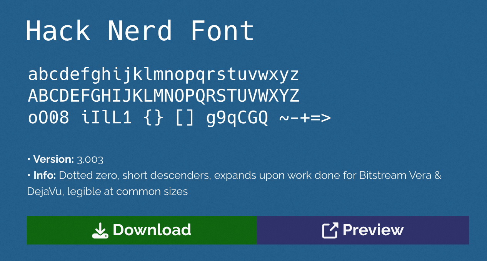
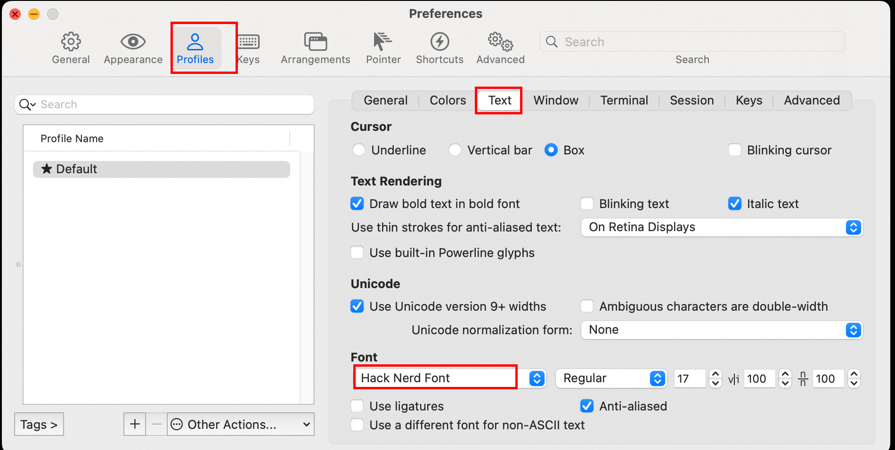
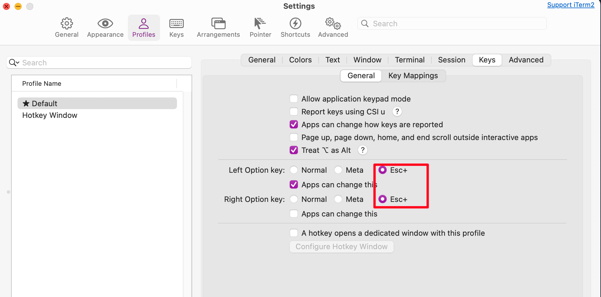
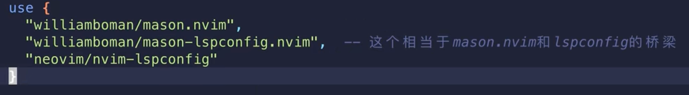
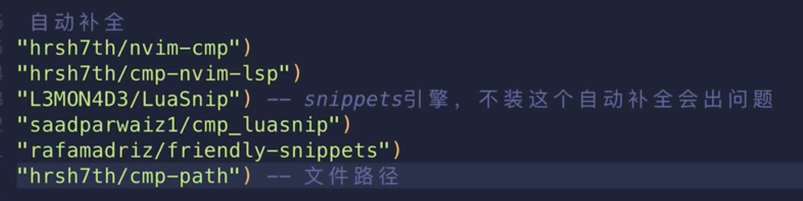
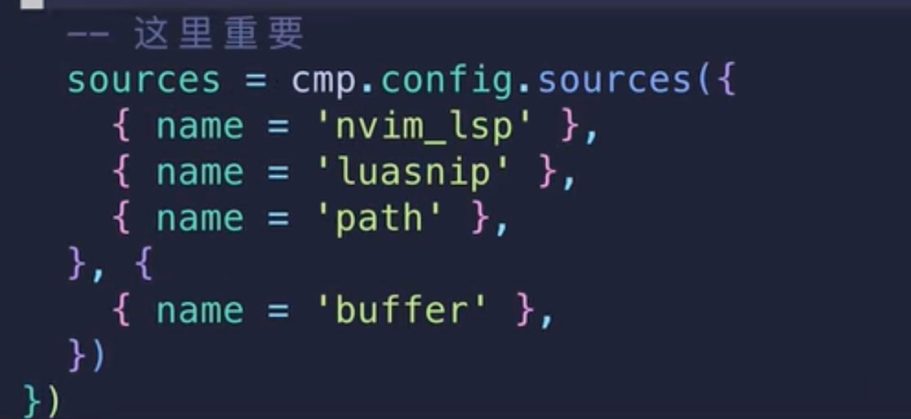

# 从零配置Neovim - B站：技术蛋老师

main分支为视频介绍的Packer插件管理配置
lazy分支为Lazy插件管理配置

主要参考

1. https://github.com/eggtoopain/Neovim-Configuration-Tutorial
2. https://www.bilibili.com/video/BV1Td4y1578E/?spm_id_from=333.337.search-card.all.click&vd_source=680a93e4d47198f05ee1b3ed6929a3a9

# 目录

```

├── README.md
├── env_install.sh       // 安装脚本
└── nvim                 // 最终会被软链到自己的安装目录中
    ├── init.lua
    ├── lua
    │   ├── core	// 核心配置文件夹
    │   │   │── options.lua
    │   │   └── keymaps.lua         // 2. 新老插件的快捷键配置，定义在这里
    │   └── plugins      // 所有关键的插件配置
    │       ├── plugins-setup.lua   // 1. packer是插件安装新的插件，需要在这里配置
    │       ├── autopairs.lua       // 1.1 新插件等等的配置，可以配置在这里
    │       ├── bufferline.lua
    │       ├── cmp.lua
    │       ├── comment.lua
    │       ├── gitsigns.lua
    │       ├── lsp.lua
    │       ├── lualine.lua
    │       ├── nvim-tree.lua
    │       ├── telescope.lua
    │       └── treesitter.lua
    └── plugin        // packar插件默认生成的文件夹，一般不需要改动
        └── packer_compiled.lua
```

# 基础知识

* ~/.config/nvim 是nvim的配置文件的默认文件夹，其中的init.lua相当于启动文件, nvim会自动根据里面的配置来启动nvim。
* init.lua文件中，加载配置好的模块化的nvim配置，并且不用写init/xxx 这个init前缀，也不需要再配置模块中写.lua后缀。 :so 重新加载nvim配置。
* Packer是目前的插件管理器。

## nvim

* a 表示新增文件。
* shift+l, shift+r 来切换左右的文件

## packer

:PackerSync : 在修改了插件配置（如新增或移除插件）后，用于同步插件状态。

:PackerUpdate : 当需要更新现有插件到最新版本时使用。

:PackerCompile : 在修改了插件配置文件后，重新生成优化后的加载配置以提升性能。

```

-- You must run this or `PackerSync` whenever you make changes to your plugin configuration
-- Regenerate compiled loader file
:PackerCompile

-- Remove any disabled or unused plugins
:PackerClean

-- Clean, then install missing plugins
:PackerInstall

-- Clean, then update and install plugins
-- supports the `--preview` flag as an optional first argument to preview updates
:PackerUpdate

-- Perform `PackerUpdate` and then `PackerCompile`
-- supports the `--preview` flag as an optional first argument to preview updates
:PackerSync

-- Show list of installed plugins
:PackerStatus

-- Loads opt plugin immediately
:PackerLoad completion-nvim ale
```

# 插件目录

1. packer 是目前的插件管理器。已经配置了新增插件配置后，会自动安装。

   * nvim/lua/plugins/plugins-setup.lua 是新增插件需要自动安装的地方。
   * 安装packer后，nvim/plugin/xx 这个文件夹一般是不需要动的。
   * https://github.com/wbthomason/packer.nvim
2. tokyonight 是主题插件。一般第2个装
3. lualini 是状态栏。一般第3个安装，因为有些状态栏不支持某些主题。
   * 注意lualine.nvim的配置中引用了tokyonight主题。
4. nvim-tree 是左侧的目录树。
   1. require：目录树里面的文件会有图标，使用图标需要特定的字体。例如hack nerd font，这个需要下载。https://www.nerdfonts.com/。如果有些图标不显示，需要安装这个字体~https://www.nerdfonts.com/font-downloads  
   2. mac 笔记本如何安装字体呢：brew install --cask font-hack-nerd-font
   3. 在iterm2里面配置: hack nerd font 字体即可
       
   4. vscode里面直接配置了默认的hack nerd font, 所以可以不必再配置了

5. vim-tmux-navigator 来配置多个窗口之间的快速跳转。现在利用C-lhjkl来窗口之间的跳动

   1. 下面的配置配置完后好像也没用，所以放弃使用M-来作为快捷键了。



6. nvim-treesitter 是语法高亮插件。

   1. 可能会需要gcc等编译插件，所以宿主机可以根据提示安装
7. nvim-ts-rainbow 和treesitter配合使用，它能够不同括号区分不同的颜色。

   1. 注意安装依赖nvim-treesitter先安装，所以Packer
8. 配置LSP插件server，才能有写代码的语法提示，设计三个插件。

   1. mason
   2. mason-lspconfig
   3. nvim-lspconfig

      
9. 自动补全。

   1. ctrl +f /b 来浏览提示
   2. 
   3. 
   4. nvim/lua/plugins/cmp.lua 可以添加更多的插件补全配置



10. 两个注释插件。

    1. gc 注释，再次选中后gc就是取消注释
11. git提示和注释


12. 文件检索插件 telescope + plenary 两个插件。
    1. 环境里面需要惨状livegrep
